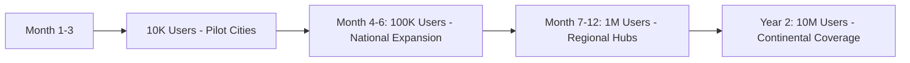

# Afri Rep - Social Reputation Platform for Africa 🌍

> **Building Africa's Trust Economy - Where Your Reputation Unlocks Opportunities**

**Afri Rep** is a continent-wide platform that transforms social trust into economic power. We're building Africa's digital reputation layer by combining traditional community values with cutting-edge technology to create opportunities for millions.

## 🌟 Why Afri Rep?

Africa has the world's youngest population with incredible talent, but traditional systems often fail to recognize informal skills and community trust. Afri Rep solves this by:

- **Digitizing Social Capital**: Turning community trust into verifiable reputation
- **Bridging Informal/Formal Economies**: Connecting traditional trust networks with modern opportunities
- **Creating Pan-African Opportunities**: Breaking down barriers between African nations
- **Empowering Youth**: 60% of Africa's population is under 25 - we're building for them

## 🚀 Key Features

### 🌍 Pan-African Identity System
- **Unified African Profile**: Single identity across 54 countries
- **Multilingual Support**: English, French, Portuguese, Arabic + major local languages
- **Cross-Border Reputation**: Build reputation that travels across Africa
- **Cultural Adaptation**: Interface adapts to regional preferences and customs

### 💼 Continent-Wide Opportunity Marketplace
- **Local & Remote Work**: Opportunities from Cape to Cairo
- **Skill-Based Matching**: AI-powered matching based on verified skills
- **Micro-Entrepreneurship**: Support for small businesses and hustles
- **Pan-African Projects**: Connect talent across borders for larger projects

### 🤝 Community Trust Networks
- **Ubuntu Principles**: "I am because we are" - community validation
- **Traditional Systems**: Digital adaptation of Susu, Stokvel, Iqub, etc.
- **Cross-Community Trust**: Build reputation across different ethnic and national groups
- **Community Moderation**: Local communities maintain quality standards

### 💳 Africa-First Financial System
- **Multi-Currency Support**: Local currencies + pan-African digital currency
- **Mobile Money Integration**: M-Pesa, Orange Money, MTN Mobile Money, etc.
- **Cross-Border Payments**: Low-cost remittances within Africa
- **Micro-Finance Access**: Reputation-based credit scoring

## 🎯 Target Markets

### Phase 1: Key Hubs (Months 1-6)
- **Nigeria**: Largest economy, tech ecosystem
- **Kenya**: Mobile money leadership, innovation hub
- **South Africa**: Most developed financial markets
- **Ghana**: Stable democracy, growing tech scene
- **Egypt**: North African gateway, large population

### Phase 2: Regional Expansion (Months 7-12)
- **East Africa**: Tanzania, Uganda, Rwanda, Ethiopia
- **West Africa**: Senegal, Côte d'Ivoire, Cameroon
- **Southern Africa**: Angola, Zambia, Zimbabwe
- **North Africa**: Morocco, Tunisia, Algeria

### Phase 3: Continent Coverage (Year 2)
- **All 54 African nations**
- **Diaspora integration**
- **Global partnerships**


### Backend Services
- **API Gateway**: Regional endpoints for low latency
- **Database**: Distributed across African data centers
- **Blockchain**: Layer 2 solutions for low-cost transactions
- **CDN**: African-based content delivery network

### Regional Infrastructure
```
🇳🇬 Lagos, Nigeria - West Africa Hub
🇰🇪 Nairobi, Kenya - East Africa Hub  
🇿🇦 Johannesburg, South Africa - Southern Africa Hub
🇪🇬 Cairo, Egypt - North Africa Hub
```

## 📱 Core Features Deep Dive

### 1. Pan-African Skill Verification
```typescript
interface AfricanSkill {
  id: string;
  name: string; // Localized name
  category: SkillCategory;
  regionalVariants: Map<string, string>; // Local names
  verificationMethods: VerificationType[];
  crossBorderWeight: number; // How transferable across borders
}
```

### 2. Multicurrency Financial System
- **Local Currencies**: NGN, KES, ZAR, GHS, EGP, etc.
- **Pan-African Stablecoin**: AfriDollar (AFD) - 1:1 USD peg
- **Mobile Money Integration**: Direct API connections
- **Cash-Out Options**: Local bank transfers, mobile money, agent networks

### 3. Cross-Border Trust Bridges
```typescript
// Trust translation between different systems
class TrustBridge {
  convertReputation(sourceCountry: string, targetCountry: string, score: number): number;
  calculateTrustWeight(regionalFactors: RegionalTrustFactors): number;
  validateCrossBorderTransaction(parties: CrossBorderParty[]): boolean;
}
```

## 🌍 Cultural Adaptation Framework

### Regional Customizations

**West Africa Focus:**
- Support for Yoruba, Igbo, Hausa languages
- Integration with Ajo/Esusu traditions
- Market woman/trader-friendly interface
- High population density optimizations

**East Africa Focus:**
- Swahili language support
- M-Pesa deep integration
- Agricultural skill categories
- Mobile data cost optimization

**Southern Africa Focus:**
- Multiple official languages
- Mining and industrial skills
- Formal/informal economy bridging
- Stokvel digital transformation

**North Africa Focus:**
- Arabic and French interfaces
- Islamic finance compliance
- Desert region connectivity solutions
- Mediterranean trade connections


## 📊 Business Model

### Revenue Streams
1. **Premium Features** (Freemium model)
2. **Transaction Fees** (1% on successful opportunities)
3. **Enterprise Solutions** (Business verification services)
4. **API Access** (Developers building on our platform)
5. **Data Insights** (Anonymized market intelligence)

### Impact Metrics
- **Jobs Created**: Target 1M opportunities in Year 1
- **Financial Inclusion**: Bring 5M unbanked Africans into digital economy
- **Skill Development**: 10M skills verified across continent
- **Cross-Border Trade**: Facilitate $100M in pan-African transactions

## 🤝 Partnerships & Ecosystem

### Strategic Partners
- **African Union**: Continental digital identity initiatives
- **AFREXIMBANK**: Cross-border payment infrastructure
- **Mobile Network Operators**: Airtel, MTN, Orange, Safaricom
- **Local Governments**: Digital transformation partnerships

### Technology Partners
- **Flutterwave**: Payment processing
- **Paystack**: Nigerian payment solutions
- **Jumo**: African fintech infrastructure
- **Shecluded**: Women-focused financial services

## 🌟 Success Stories (Projected)

### Case Study: Fatima's Fashion Business
*Lagos → Nairobi → Johannesburg*

**Before Afri Rep:**
- Limited to Lagos markets
- Cash-only transactions
- No verifiable business reputation

**After Afri Rep:**
- Customers in 3 African countries
- Digital payments across borders
- 4.8/5 reputation score
- 300% revenue increase

### Case Study: Samuel's Tech Skills  
*Kampala → Remote Pan-African Work*

**Before Afri Rep:**
- Local freelance opportunities only
- Payment delays and disputes
- Skills not formally recognized

**After Afri Rep:**
- Projects with companies in 5 countries
- Escrow-protected payments
- Verified skill badges
- Continuous learning path


## 📈 Growth Strategy

### User Acquisition Timeline


### Market Penetration Approach
1. **University Partnerships**: Target youth in major African universities
2. **Market Trader Onboarding**: Digitize informal sector businesses
3. **Diaspora Engagement**: Connect Africans abroad with home opportunities
4. **Government Partnerships**: National digital skills verification

## 🔒 Security & Compliance

### Data Sovereignty
- **African Data Centers**: Primary storage within continent
- **GDPR + Local Laws**: Compliant with all regional regulations
- **User Data Control**: Complete transparency and user ownership

### Financial Compliance
- **Central Bank Approvals**: Licensed in each operating country
- **Anti-Money Laundering**: Advanced AML/KYC systems
- **Tax Compliance**: Automated tax calculation and reporting

## 🌱 Sustainability & Impact

### UN Sustainable Development Goals
- **SDG 1**: No Poverty - Economic empowerment
- **SDG 4**: Quality Education - Skills development
- **SDG 5**: Gender Equality - Women's economic inclusion
- **SDG 8**: Decent Work - Job creation
- **SDG 9**: Industry Innovation - Digital infrastructure
- **SDG 10**: Reduced Inequality - Cross-border opportunity

### Environmental Commitment
- **Carbon Neutral Operations**: Offset all digital carbon footprint
- **Green Hosting**: African data centers with renewable energy
- **Digital Inclusion**: Reduce need for physical travel and paperwork

### For Investors
We're building the digital infrastructure for Africa's economic integration.  


## 🌟 Our Vision

> **"To create a digitally connected Africa where every individual's skills and reputation can unlock opportunities across the continent, breaking down colonial-era barriers and building a prosperous, integrated African economy."**

*Afri Rep - Your African reputation, your continental passport to opportunity.*

**Built for Africa, by Africans, serving the world.** 🌍

---

*© 2024 Afri Rep. Proudly African. Globally Minded.*
