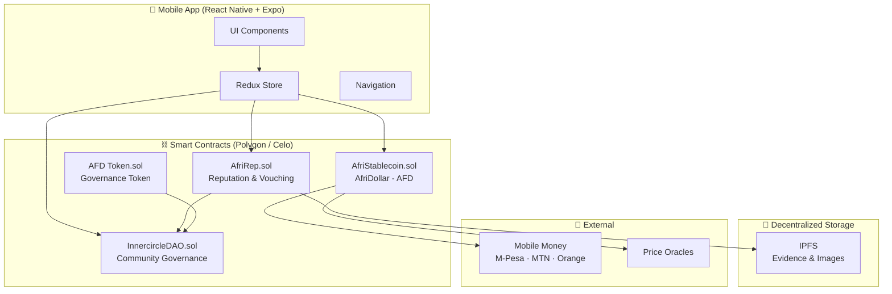

<p align="center">
  <h1 align="center">🌍 Afri Rep</h1>
  <p align="center">
    <strong>Africa's Digital Reputation Layer — Where Trust Unlocks Opportunity</strong>
  </p>
  <p align="center">
    <a href="https://github.com/Jenola344/Afri-Rep/blob/main/LICENSE"></a>
    <a href="https://soliditylang.org/"></a>
    <a href="https://reactnative.dev/"></a>
    <a href="https://polygon.technology/"></a>
    <a href="https://github.com/Jenola344/Afri-Rep/blob/main/CONTRIBUTING.md"></a>
  </p>
</p>

---

**Afri Rep** is a pan-African platform that transforms social trust into verifiable economic power. By combining traditional community values (Ubuntu, Ajo, Stokvel) with blockchain technology, we create a portable reputation system that works across all 54 African nations — unlocking jobs, credit, and opportunities for millions.

## 📐 Architecture


```mermaid
graph TB
    subgraph Frontend["📱 Mobile App (React Native + Expo)"]
        UI[UI Components]
        Redux[Redux Store]
        Nav[Navigation]
    end

    subgraph Contracts["⛓️ Smart Contracts (Polygon / Celo)"]
        AR[AfriRep.sol<br/>Reputation & Vouching]
        AFD[AfriStablecoin.sol<br/>AfriDollar - AFD]
        TKN[AFD Token.sol<br/>Governance Token]
        DAO[InnercircleDAO.sol<br/>Community Governance]
    end

    subgraph Storage["💾 Decentralized Storage"]
        IPFS[IPFS<br/>Evidence & Images]
    end

    subgraph Integrations["🔗 External"]
        MM[Mobile Money<br/>M-Pesa · MTN · Orange]
        Oracle[Price Oracles]
    end

    UI --> Redux
    Redux --> AR
    Redux --> AFD
    Redux --> DAO
    AR --> IPFS
    AFD --> Oracle
    AFD --> MM
    AR --> DAO
    TKN --> DAO
```

## 🚀 Key Features

| Feature | Description | Contract |
|---------|-------------|----------|
| **🏆 Rep Scores** | Earn 0–1000 reputation through community vouches with cross-border multipliers | `AfriRep.sol` |
| **🤝 Vouching System** | Vouch for skills with 1–5 confidence + IPFS evidence | `AfriRep.sol` |
| **💰 AfriDollar (AFD)** | Pan-African stablecoin pegged 1:1 to USD with multi-currency fiat ramps | `AfriStablecoin.sol` |
| **🏛️ Inner Circle DAOs** | Reputation-gated communities with proposal voting and treasury management | `InnercircleDAO.sol` |
| **🌐 Cross-Border Trust** | Reputation translates across regions with regional trust bridges | `AfriRep.sol` |
| **📊 Skill Verification** | Categorized skills (Tech, Business, Creative, Trades, Academic, Social) | `AfriRep.sol` |

## 📂 Project Structure

```
Afri-Rep/
├── AfriRep-sol/                  # Core reputation contract
│   ├── AfriRep.sol               # Main contract: profiles, vouching, reputation
│   ├── AfriRep_Flattened.sol     # Flattened for verification
│   └── interfaces/
│       └── IAfriRep.sol          # Interface definition
│
├── AFD Token/                    # Governance token
│   └── AFD Token.sol             # ERC-20 with liquidity lock
│
├── AfriRepStablecoin/            # Pan-African stablecoin
│   ├── AfriRepStablecoin.sol     # Multi-currency fiat ramp
│   └── Contract address          # Deployed address on Polygon
│
├── Innercircle DAO/              # Community governance
│   └── InnercircleDAO.sol        # Reputation-gated DAO
│
├── website/                      # Landing page
│   ├── index.html
│   ├── styles.css
│   └── script.js
│
├── App.tsx                       # React Native entry point
├── DashboardScreen.tsx           # Main dashboard UI
├── RepScore.tsx                  # Circular reputation display
├── VouchInterface.tsx            # Vouching UI component
├── theme.ts                      # Design system tokens
├── index.ts                      # TypeScript type definitions
├── local.ts                      # Local deployment script
├── Afri.test.ts                  # Smart contract tests
│
├── CONTRIBUTING.md               # Contribution guidelines
├── SECURITY.md                   # Security policy
├── LICENSE                       # MIT License
└── README.md                     # You are here
```

## ⛓️ Deployed Contracts

| Contract | Network | Address | Status |
|----------|---------|---------|--------|
| AfriStablecoin (AFD) | Polygon | `0xc137c53e31519bc88e40a6dc16ac13d7f86410e5` | ✅ Verified |
| AfriRep | Polygon | *Deployment pending* | 🟡 Staging |
| InnercircleDAO | Polygon | *Deployment pending* | 🟡 Staging |
| AFD Token | Polygon | *Deployment pending* | 🟡 Staging |

## 🛠️ Getting Started

### Prerequisites

- **Node.js** >= 18.x
- **npm** >= 9.x
- **Git**

### Installation

```bash
# Clone the repository
git clone https://github.com/Jenola344/Afri-Rep.git
cd Afri-Rep

# Install dependencies
npm install
```

### Smart Contract Development

```bash
# Compile all contracts
npm run compile

# Run test suite
npm test

# Deploy to local Hardhat network
npx hardhat node                           # Terminal 1
npm run deploy:local                       # Terminal 2
```

### Mobile App (Expo)

```bash
# Start the development server
npm start

# Platform-specific
npm run android
npm run ios
npm run web
```

### Landing Page

```bash
# Open in browser
open website/index.html
# Or serve locally
npx serve website/
```

## 🧪 Testing

```bash
# Run all smart contract tests
npm test

# Run with gas reporting
REPORT_GAS=true npm test

# Run with coverage
npx hardhat coverage
```

### Test Coverage

| Contract | Tests | Status |
|----------|-------|--------|
| AfriRep.sol | User registration, vouching, cross-border reputation | ✅ |
| AfriStablecoin.sol | Minting, burning, multi-currency | 🟡 Expanding |
| InnercircleDAO.sol | Proposals, voting, execution | 🟡 Expanding |
| AFD Token.sol | Supply, liquidity lock, transfers | 🟡 Expanding |

## 🌍 Supported Regions

### Phase 1 — Key Hubs
🇳🇬 Nigeria · 🇰🇪 Kenya · 🇿🇦 South Africa · 🇬🇭 Ghana · 🇪🇬 Egypt

### Phase 2 — Regional Expansion
🇹🇿 Tanzania · 🇺🇬 Uganda · 🇷🇼 Rwanda · 🇪🇹 Ethiopia · 🇸🇳 Senegal · 🇨🇮 Côte d'Ivoire · 🇨🇲 Cameroon

### Phase 3 — Continent Coverage
All 54 African nations + Diaspora integration

## 💱 Supported Currencies

| Currency | Code | Rate (per 1 AFD) |
|----------|------|-------------------|
| Nigerian Naira | NGN | 800 |
| Kenyan Shilling | KES | 150 |
| South African Rand | ZAR | 18 |
| Ghanaian Cedi | GHS | 12 |
| Egyptian Pound | EGP | 30 |
| *More coming...* | XOF, XAF, TZS, UGX | *Phase 2* |

## 🔐 Security

- **Upgradeable Proxies** — OpenZeppelin UUPS pattern for safe contract upgrades
- **Role-Based Access** — Granular permissions (ADMIN, VALIDATOR, MINTER, BURNER)
- **Reentrancy Protection** — Guards on all state-changing external functions
- **Emergency Pause** — Circuit breaker pattern on critical operations
- **Audit Status** — Actively seeking audit partners (see [SECURITY.md](SECURITY.md))

## 🤝 Contributing

We welcome contributions from developers across Africa and beyond! See our [Contributing Guide](CONTRIBUTING.md) for:

- Development setup instructions
- Code style guidelines
- Pull request process
- Areas where we need help

## 📊 Impact Goals

| Metric | Year 1 Target |
|--------|---------------|
| Jobs Created | 1,000,000 opportunities |
| Financial Inclusion | 5,000,000 unbanked users onboarded |
| Skills Verified | 10,000,000 across the continent |
| Cross-Border Trade | $100,000,000 facilitated |

## 📄 License

This project is licensed under the MIT License — see [LICENSE](LICENSE) for details.

## 🌟 Vision

> *"To create a digitally connected Africa where every individual's skills and reputation can unlock opportunities across the continent, breaking down barriers and building a prosperous, integrated African economy."*

**Built for Africa, by Africans, serving the world.** 🌍

---

<p align="center">
  <sub>© 2024-present Afri Rep Contributors · <a href="SECURITY.md">Security</a> · <a href="CONTRIBUTING.md">Contributing</a> · <a href="LICENSE">License</a></sub>
</p>
